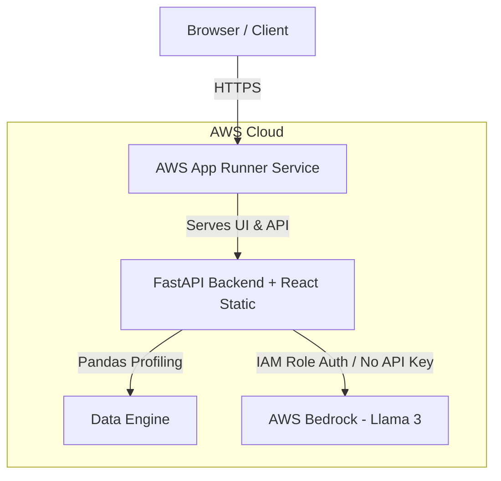

# 🚀 Complete AWS Deployment Guide for Data Explainer


This guide walks you through deploying **Data Explainer** on **AWS** using **AWS App Runner** + **AWS Bedrock (Llama 3)**.

---

## 🏗 Architecture Overview



---

## Method 1: Deploying via AWS App Runner (Console - Recommended)

AWS App Runner automatically builds your GitHub repo, runs the Docker container, provides free SSL HTTPS, and scales automatically.

### Step 1: Connect your GitHub Repo to AWS
1. Log into your **AWS Management Console**.
2. Search for **App Runner** in the top search bar and click **Create an App Runner service**.
3. Under **Source**, choose **Source code repository**.
4. Click **Add new connection** to link your GitHub account and select your `data-explainer` repository.
5. Set branch to `main`.

### Step 2: Configure Build Settings
* **Deployment trigger:** Automatic
* **Build provider:** Use a Dockerfile
* **Dockerfile path:** `Dockerfile` (or `data-explainer/Dockerfile` if in a subfolder)
* **Port:** `8000`

### Step 3: Configure Service & Environment Variables
Set the following Environment Variables in App Runner:

| Variable | Value | Description |
| :--- | :--- | :--- |
| `LLM_PROVIDER` | `bedrock` | Uses AWS Bedrock serverless models |
| `AWS_REGION` | `us-east-1` | AWS Region where Bedrock is enabled |
| `AWS_BEDROCK_MODEL_ID` | `meta.llama3-8b-instruct-v1:0` | Llama 3 Model ID |
| `PORT` | `8000` | Application port |

### Step 4: Attach IAM Role for AWS Bedrock Access
1. Under **Instance role**, select or create an IAM Role.
2. In the IAM Console, attach the `AmazonBedrockFullAccess` policy (or add `bedrock:InvokeModelWithResponseStream` permission) to this role.
3. Click **Create & Deploy**.

Within 3–5 minutes, AWS will provide you with a live HTTPS URL (e.g. `https://xxx.us-east-1.awsapprunner.com`)!

---

## Method 2: Deploying via AWS Elastic Container Registry (ECR) + App Runner (CLI)

If you have AWS CLI installed:

```bash
# 1. Login to AWS ECR
aws ecr get-login-password --region us-east-1 | docker login --username AWS --password-stdin <YOUR_ACCOUNT_ID>.dkr.ecr.us-east-1.amazonaws.com

# 2. Create ECR repository
aws ecr create-repository --repository-name data-explainer

# 3. Build & tag Docker image
docker build -t data-explainer .
docker tag data-explainer:latest <YOUR_ACCOUNT_ID>.dkr.ecr.us-east-1.amazonaws.com/data-explainer:latest

# 4. Push to AWS ECR
docker push <YOUR_ACCOUNT_ID>.dkr.ecr.us-east-1.amazonaws.com/data-explainer:latest
```

Then create an App Runner service pointing to your ECR image!

---

## Method 3: Deploying on AWS Lightsail Containers (Low Flat Monthly Cost)

AWS Lightsail Containers starts at **$7/month**:

1. Search for **Lightsail** in the AWS Console.
2. Click **Containers** -> **Create container service**.
3. Push your container image or connect GitHub.
4. Set environment variable `LLM_PROVIDER=bedrock` (or `LLM_PROVIDER=anthropic`).
5. Open port `8000` to HTTP traffic.
