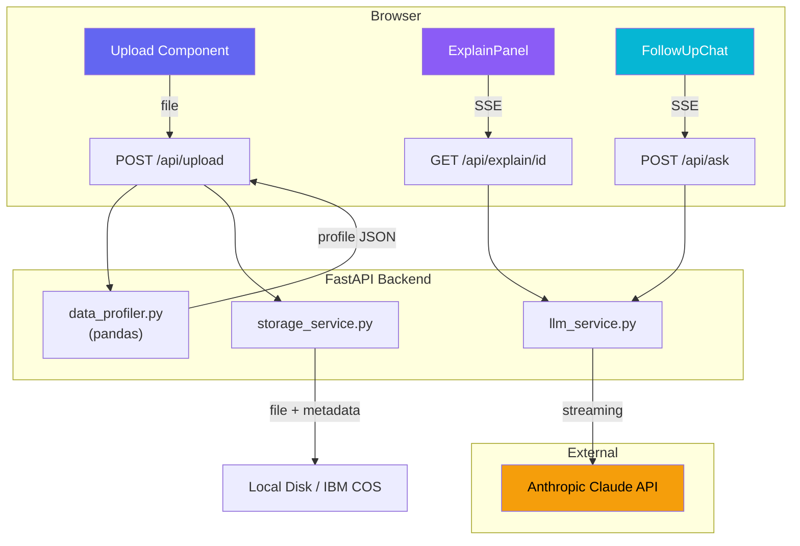

# Data Explainer — Project Report

## 1. Introduction

**Data Explainer** is a full-stack AI web application that allows users to upload a CSV or Excel file and receive an instant, AI-generated, plain-language explanation of their data. The application profiles the dataset using pandas, sends the structured profile to Anthropic's Claude LLM, and streams the explanation to the user token-by-token. A multi-turn follow-up chat enables deeper exploration of the same dataset.

This project was developed as part of the **IBM SkillsBuild × Bharat Cares "Vibe Coding" GenAI + Cloud Computing** internship program.

---

## 2. Technology Stack

| Layer | Technology | Version | Purpose |
|-------|-----------|---------|---------|
| **Frontend** | React | 18.3 | Component-based UI |
| | Vite | 6.0 | Build tool + dev server |
| | Tailwind CSS | 3.4 | Utility-first styling |
| | react-markdown | 9.0 | Render streamed markdown |
| **Backend** | Python | 3.11 | Runtime |
| | FastAPI | 0.115 | Async API framework |
| | pandas | 2.2 | Data profiling |
| | openpyxl | 3.1 | Excel file support |
| | pydantic-settings | 2.7 | Config from env vars |
| **LLM** | Anthropic Claude | claude-sonnet-4-20250514 | Streaming analysis |
| | anthropic SDK | 0.42 | API client |
| **Infra** | Docker | Multi-stage | Containerization |
| | Render.com | Free tier | Cloud deployment |

---

## 3. Architecture



### Data Flow

1. **Upload:** User drops a CSV/XLSX → frontend validates type/size → `POST /api/upload` → FastAPI validates server-side → pandas profiles the data → file + profile stored → JSON response with `file_id`, `preview`, `profile`
2. **Explain:** Frontend opens `GET /api/explain/{file_id}` → backend retrieves profile → builds structured prompt → calls Claude `messages.stream()` → yields SSE events (`data: {"token": "..."}`) → frontend renders markdown incrementally
3. **Follow-up:** User types question → `POST /api/ask` with `{file_id, question}` → backend appends to conversation history → calls Claude with full context → streams answer via SSE

---

## 4. Prompting Strategy

### 4.1 System Prompt (Explanation)

The system prompt instructs Claude to act as an expert data analyst and structure the response with specific sections:

```
You are an expert data analyst. Analyze the provided dataset profile
and give a comprehensive, plain-language explanation.

Structure your response with these sections:
## 📊 Overview
## 📐 Structure & Quality
## 📈 Key Statistics
## 🔗 Correlations & Relationships
## ⚠️ Anomalies & Concerns
## 💡 Recommendations

Be specific — cite actual numbers from the profile.
```

### 4.2 User Prompt (Profile Data)

The profile prompt is **structured data, not a raw data dump**. This is a critical design decision — sending the full dataset would be wasteful (token cost) and potentially insecure. Instead, we send:

```
**Dataset Shape:** 891 rows × 12 columns

**Columns:**
- **PassengerId** (type: `int64`, 0.0% missing, 891 unique values)
  - Mean: 446.0, Median: 446.0, Std: 257.3, Min: 1, Max: 891
- **Survived** (type: `int64`, 0.0% missing, 2 unique values)
  - Mean: 0.3838, Median: 0.0, Std: 0.4866, Min: 0, Max: 1
- **Name** (type: `object`, 0.0% missing, 891 unique values)
  - Top values: Braund, Mr. Owen Harris (1), Cumings, Mrs. John Bradley (1)

**Correlations (numeric columns):**
- PassengerId ↔ Survived: -0.005
- Survived ↔ Pclass: -0.3385
- Age ↔ Fare: 0.0961
```

### 4.3 Follow-up System Prompt

For follow-up Q&A, the dataset profile is embedded in the system prompt as context, and the full conversation history (previous Q&A turns) is passed as messages:

```
You are an expert data analyst. You have already analyzed a dataset.
Answer the user's follow-up questions using the dataset profile below.

[dataset profile]

Be specific, reference actual numbers, and use markdown formatting.
```

This ensures Claude has persistent context across all turns without resending the profile in every user message.

---

## 5. Development Summary (Phase-by-Phase)

### Phase 1: Project Scaffold
- Created full directory structure: `frontend/`, `backend/`, Docker files, docs
- Configured Vite + React + Tailwind CSS 3 with PostCSS
- Set up FastAPI project with pydantic-settings for config management

### Phase 2: Backend — Upload + Pandas Profiling
- Implemented `DataProfiler` class with comprehensive pandas analysis
- Shape, dtypes, missing-value percentages per column
- Summary statistics (mean, median, std, min, max) for numeric columns
- Top-5 value counts for categorical columns
- Full correlation matrix for numeric columns
- Server-side file validation (extension, size ≤ 10 MB, non-empty)
- Custom numpy-to-Python type converter for JSON serialization safety

### Phase 3: Backend — Claude Streaming
- Integrated `anthropic.AsyncAnthropic` with `messages.stream()`
- Built structured prompt from profile data (not raw data)
- SSE endpoint (`text/event-stream`) yielding `data: {"token": "..."}` events
- Graceful fallback message when API key is not configured

### Phase 4: Backend — Storage Service
- Local filesystem storage with in-memory cache for fast retrieval
- JSON metadata persistence for profile + preview
- Designed for optional IBM COS upgrade (S3-compatible interface)

### Phase 5: Frontend — Upload + Preview + Streaming
- Drag-and-drop upload zone with client-side validation
- Responsive data preview table with color-coded type badges
- SSE consumption via `fetch()` + `ReadableStream` with proper buffering
- Markdown rendering of streamed explanation using `react-markdown`
- Loading skeletons and streaming cursor animation

### Phase 6: Frontend — Follow-up Chat
- Chat bubble UI with user/assistant message styling
- Multi-turn conversation with full context preservation
- Suggestion chips for common questions
- Streaming response rendering with error handling

### Phase 7: Polish
- Dark glassmorphism theme with gradient accents
- Custom scrollbar styling
- Animated transitions (fade-in, slide-up)
- Mobile responsive down to 375px viewport
- Error toast notifications with dismiss

### Phase 8: Dockerization
- Multi-stage Dockerfile: Node build → Python runtime
- Frontend built to static files, served by FastAPI
- Non-root user for security
- docker-compose.yml for local development

### Phase 9: Deployment
- Render.com free tier with `render.yaml` blueprint
- Automatic Docker build from GitHub
- Environment variables injected as Render secrets
- Health check endpoint at `/api/health`

---

## 6. Challenges & Resolutions

| Challenge | Resolution |
|-----------|-----------|
| **Numpy types break JSON serialization** | Built `_to_python()` converter handling `np.integer`, `np.floating`, `np.bool_`, `pd.Timestamp` |
| **SSE chunks split across TCP boundaries** | Implemented buffer-based parser that splits on `\n\n` and keeps incomplete fragments |
| **Claude API requires alternating user/assistant messages** | Prepend synthetic "Analyze this dataset" user message before the initial explanation for clean multi-turn history |
| **Frontend CORS during development** | Vite proxy config routes `/api` to backend; CORS middleware configured for dev origins |
| **Large Excel files blocking async event loop** | Wrapped pandas profiling in `asyncio.to_thread()` to offload CPU work |
| **Markdown rendering flicker during streaming** | Used `react-markdown` with stable key props; appended tokens to state without re-creating component |

---

## 7. Key Learnings

1. **Profile, don't dump** — Sending structured statistical profiles to the LLM instead of raw data reduces token usage by 90%+ while producing better analysis (the LLM reasons about aggregates, not individual rows)

2. **SSE > WebSocket for streaming LLM** — Server-Sent Events are simpler, work over standard HTTP, have automatic reconnection, and are sufficient for unidirectional token streaming

3. **Async Python matters** — Using `AsyncAnthropic` and `asyncio.to_thread` prevents the pandas profiling and LLM streaming from blocking the FastAPI event loop

4. **Glassmorphism needs restraint** — `backdrop-blur` and `bg-white/[0.03]` create a premium feel, but too many layers degrade performance on mobile; limiting blur to cards only kept the UI smooth

5. **Multi-stage Docker saves 70% image size** — The Node build tools aren't shipped in the final image; only the compiled static assets and the Python runtime are included

---

## 8. Future Improvements

- **IBM Cloud Object Storage integration** — Upload files to COS for persistent, scalable storage
- **User authentication** — Support multiple users with isolated sessions
- **Chart generation** — Auto-generate visualizations (histograms, scatter plots) alongside the text explanation
- **Export to PDF** — Let users download the AI analysis as a formatted report
- **Fine-tuned prompts per domain** — Detect dataset domain (healthcare, finance, etc.) and tailor analysis
